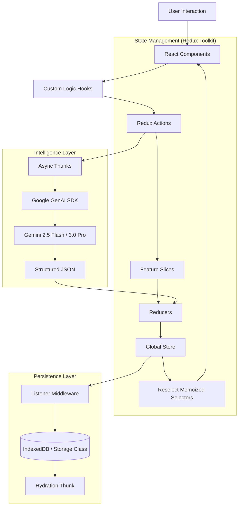

<div align="center">

# OmniNote 🧠✨
### The Cognitive Operating System for the Intelligence Era

[](https://deepwiki.com/qnbs/OmniNote)


<br />


<br />
<p align="center">
  <strong>OmniNote</strong> is not merely a note-taking application; it is a <strong>Local-First Second Brain</strong> designed to augment human cognition. By fusing structured data management with a sophisticated force-directed knowledge graph and an orchestrated swarm of AI agents, OmniNote transforms passive text storage into active knowledge engineering.
</p>

[Features](#-core-capabilities) • [Architecture](#-system-architecture) • [AI Swarm](#-ai-agent-swarm) • [Getting Started](#-getting-started)

</div>

---

## 🔮 Philosophy: The Local-First Cognitive Engine

In an era of cloud dependency, OmniNote takes a radical stance on **Data Sovereignty** and **Zero-Latency Interaction**.

1.  **Local-First Architecture**: The application state lives primarily in the user's browser (IndexedDB via Redux persistence). Cloud AI is treated as a stateless functional utility, invoked only on demand.
2.  **Structured Thought**: We enforce structure on unstructured text via Markdown, Entity Extraction, and graph topology, allowing the system to understand the *relationships* between ideas.
3.  **Agentic Workflow**: AI is not a chatbot sidebar; it is integrated into the data layer. Agents act as background processes that analyze, summarize, and connect your thoughts.

---

## ⚡ Core Capabilities

### 🕸️ Topological Knowledge Graph
Powered by **D3.js**, the graph view is a physics-simulation engine.
*   **Force-Directed Layout**: Nodes repel each other while links act as springs, clustering related concepts.
*   **Semantic Clustering**: Connections are formed explicitly via `[[Wiki-Links]]` and implicitly via shared `#tags`.
*   **Interactive Dynamics**: Real-time zoom, pan, and drag capabilities with automatic collision detection.

### 📝 The Hyper-Text Editor
A bespoke editor engine built for power users.
*   **GFM Support**: Full GitHub Flavored Markdown support with real-time syntax highlighting (`highlight.js`).
*   **Smart Parsing**: Regex-based detection of tasks (`- [ ]`) and dates (`@{YYYY-MM-DD}`) for aggregation into the Task View.
*   **Bi-Directional Linking**: Type `[[` to trigger Intellisense-like autocomplete for linking existing notes.

### 🤖 AI Orchestration
*   **Multi-Modal Agents**: Text generation, image synthesis, and strategic planning.
*   **Context-Aware**: Agents read the current note context to provide relevant outputs.
*   **Privacy-Focused**: Data is sent to the API *only* when you explicitly trigger an agent.

---

## 🏗️ System Architecture

OmniNote employs a sophisticated **Feature-Sliced** Redux architecture to manage complex state with high performance and scalability.



### Technical Implementation Details

1.  **Logic/UI Separation Pattern**: 
    Components are strictly presentational. Logic is encapsulated in custom hooks (e.g., `useNoteEditor`, `useAiAgentPanel`) which interface exclusively with Redux hooks (`useAppDispatch`, `useAppSelector`). This decouples the UI from business logic.
    
2.  **Normalized State with Entity Adapters**:
    Notes and Templates are stored using `@reduxjs/toolkit`'s `createEntityAdapter`. This normalizes data into `{ ids: [], entities: {} }` structures, ensuring `O(1)` CRUD operations and preventing unnecessary re-renders in large lists.

3.  **Middleware-Based Persistence**:
    Instead of `useEffect` chains, we use Redux Listener Middleware to intercept specific actions (like `addNote`, `updateNote`) and persist changes to IndexedDB asynchronously, keeping the UI thread unblocked.

---

## 🤖 AI Agent Swarm

OmniNote orchestrates a suite of specialized AI agents. We utilize **System Instruction Engineering** and **Strict JSON Schemas** to force the LLM into specific cognitive roles.

| Agent | Model | Cognitive Role |
| :--- | :--- | :--- |
| **The Analyst** | `gemini-2.5-flash` | **Semantic Extraction**. Analyzes text complexity, sentiment, and extracts key entities (People, Places) and taxonomy tags. |
| **The Strategist** | `gemini-3-pro-preview` | **Reasoning Engine**. Uses a higher "Thinking Budget" to decompose unstructured notes into hierarchical, strategic action plans. |
| **The Creative** | `gemini-2.5-flash` | **Divergent Thinking**. Runs with high temperature to generate lateral thinking suggestions and brainstorms. |
| **The Visualizer** | `gemini-3-pro-image` | **Multimodal Synthesis**. Converts textual concepts into visual representations (images) using varying artistic styles. |
| **The Recipes** | `gemini-2.5-flash` | **Workflow Automation**. Pre-compiled prompt chains that execute complex transformations (e.g., "Meeting Notes" -> "Executive Briefing"). |

---

## 🚀 Getting Started

### Prerequisites
*   **Node.js** v18+
*   **Google AI Studio API Key** (Required for AI features)

### Installation

1.  **Clone the Repository**
    ```bash
    git clone https://github.com/your-username/omninote.git
    cd omninote
    ```

2.  **Install Dependencies**
    ```bash
    npm install
    ```

3.  **Environment Configuration**
    Create a `.env` file in the root directory:
    ```env
    API_KEY=your_google_gemini_api_key
    ```

4.  **Launch Development Server**
    ```bash
    npm run dev
    ```

5.  **Production Build**
    ```bash
    npm run build
    ```

---

## ⚖️ License

Distributed under the MIT License.

<div align="center">
  <br />
  <sub>Built with React 19, Redux Toolkit, and Google Gemini.</sub>
</div>
